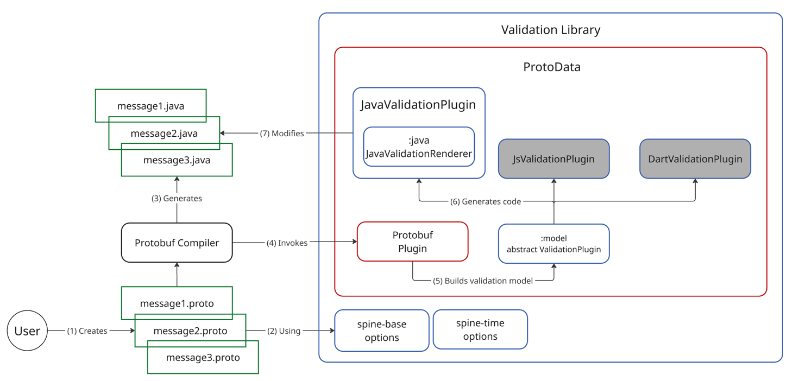
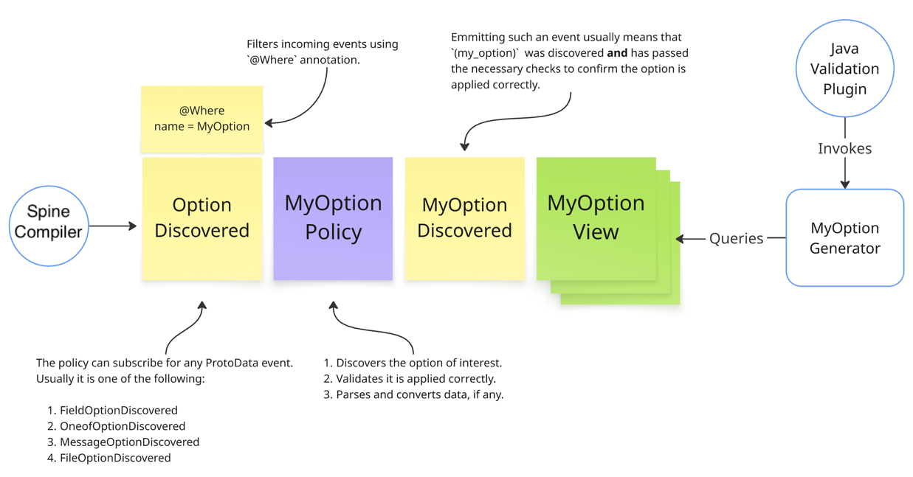

[![Ubuntu build][ubuntu-build-badge]][gh-actions]
[![codecov][codecov-badge]][codecov] &nbsp;
[![license][license-badge]][license]

# Spine Validation

This repository contains the Spine Validation library.

The library brings data validation directly into your Protobuf messages. 

Currently, only the Java target is supported.

## Table of Contents

- [Prerequisites](#prerequisites)
- [Validation in Action](#validation-in-action)
- [Architecture](#architecture)
- [Extending the Library](#extending-the-library)

## Prerequisites

This library is built with Java 17.

## Validation in Action

Define your validation rules right in the .proto file:

```protobuf
import "spine/options.proto";
import "spine/time_options.proto";

import "google/protobuf/timestamp.proto";

message CardNumber {
    string digits = 1 [(pattern).regex = "\\d{4}\\s?\\d{4}\\s?\\d{4}\\s?\\d{4}"];
    string owner = 2 [(required) = true];
    google.protobuf.Timestamp issued_at = 3 [(when).in = PAST];
}
```

At build time, Spine Validation injects assertions into the generated Java classes:

```java
var card = CardNumber.newBuilder()
    .setDigits("invalid")
    .build(); <- Validates here.
```

If any constraint is violated, a `ValidationException` is thrown from `build()`.

You can also validate without throwing:

```java
var card = CardNumber.newBuilder()
    .setDigits("invalid")
    .buildPartial(); <- No validation.
var optionalError = card.validate();
error.ifPresent(err -> {
    System.out.println(err.getMessage());
}
```

### Validation Options

The set of validation options is defined by the following files:

1. [spine-base](https://github.com/SpineEventEngine/base) supplies the core validation options with
   the [options.proto](https://github.com/SpineEventEngine/base/blob/master/base/src/main/proto/spine/options.proto).
2. [spine-time](https://github.com/SpineEventEngine/time) supplies time-related options with the
   [time_options.proto](https://github.com/SpineEventEngine/time/blob/master/time/src/main/proto/spine/time_options.proto).

Users should import these Proto files to be able to use options they define.

```protobuf
import "spine/options.proto"; // Brings all options, except for time-related ones.
import "spine/time_options.proto"; // Brings time-related options.
```

## Architecture

The library is a set of plugins for [ProtoData](https://github.com/SpineEventEngine/ProtoData).

Each target language is a separate ProtoData plugin.

Take a look at the following diagram to grasp a high-level library structure:



The workflow is the following:

- (1), (2) – user defines Protobuf messages with validation options.
- (3) – Protobuf compiler generates Java classes.
- (4), (5) – policies and views build the validation model.
- (6), (7) – Java plugin generates and injects validation code.

### Key Modules

| Module    | Description                                                          |
|-----------|----------------------------------------------------------------------|
| :model    | The language-agnostic model for the built-in options.                |
| :java     | Generates and injects Java validation code based on applied options. |
| :java-api | Extension API for custom options in Java.                            |

- `java`: the Java support of the validation library. This module knows how to converse the views
  of the applied options to the actual Java code implementing these options and how to inject this
  code into the Java classes of the compiled Protobuf messages. By default, it takes into account
  only the built-in options provided by the `:model`, but it is also possible to provide custom
  implementations of `ValidationOption` to extend the built-in options with custom ones. More on
  that is explained in a dedicated [section](#extending-the-library).

- `java-api`: an extension point to the validation library. Contains API that can be used 
  to implement a custom validation option for Java.

# Extending the library

Users can extend the library providing custom Protobuf options and code generation logic for them.

Below is an overview of steps that should be done to create a custom option:

1. Declare a [custom](https://protobuf.dev/programming-guides/proto3/#customoptions) option
   within Protobuf.
2. Provide an implementation of `io.spine.option.OptionsProvider` that registers the created option
   in `com.google.protobuf.ExtensionRegistry`. This step is required for the Java target.
3. Implement the following entities:
   - `MyOptionPolicy` – discovers and validates the option, optionally reporting warnings 
     or compilation errors.
   - `MyOptionView` – accumulates valid option applications. Each view is supposed to contain all 
     necessary information for the code generation.
   - `MyOptionGenerator` – generates Java code for the option applications within 
     the compilation messages.
4. Provide an implementation of `io.spine.validation.api.ValidationOption` passing the created
   policy, view and generator. Further, `JavaValidationPlugin` will incorporate these entities.

Below is a workflow diagram for a typical option:



Note that a custom option can provide several policies and views, but only one generator.
This allows building more complex models, using more entities and events.

Let's take a closer look at each entity.

### Policy

Usually, this is an entry point to the option handling. 

The policy subscribes to one of `*OptionDiscovered` events: 

- `FileOptionDiscovered`.
- `MessageOptionDiscovered`.
- `FielddOptionDiscovered`.
- `OneofOptionDiscovered`.

It filters incoming events, taking only those who contain the option of the interest.
The policy may validate the option application, query `TypeSystem`, extract and transform
data arrived with the option, if any. Once ready, it emits an event signaling that the discovered 
option is valid and ready for the code generation.

The policy may report a compilation warning or an error, failing the whole compilation if it
finds an illegal application of the option. 

For example:

1. An unsupported field type.
2. Illegal option content (invalid regex, parameter, signature).

The policy may just ignore the discovered option emitting `NoReaction`. A typical example
of this is a boolean option, such as `(required)`, which does nothing when it is set to `false`.

The desired behavior depends on the option itself.

### View

Views are usually the simplest entities. They just accumulate events from the policies serving 
as data providers of the validation model for code generators.

Usually, one view represents a single application of an option.

Views are not supposed to do something smart, usually they just accumulate data. Use policies 
whenever possible to accommodate your logic.

### Generator

We always have one code generator per option. The generator is asked to provide Java code for all
applications of a specific option within the given message type.

It has access to `Querying` and can query views using a filter to find ones that belong to its
message of interest.

The generator is an entity that provides an actual implementation of the option behavior.

[codecov]: https://codecov.io/gh/SpineEventEngine/validation
[codecov-badge]: https://codecov.io/gh/SpineEventEngine/validation/branch/master/graph/badge.svg
[license-badge]: https://img.shields.io/badge/license-Apache%20License%202.0-blue.svg?style=flat
[license]: http://www.apache.org/licenses/LICENSE-2.0
[gh-actions]: https://github.com/SpineEventEngine/validation/actions
[ubuntu-build-badge]: https://github.com/SpineEventEngine/validation/actions/workflows/build-on-ubuntu.yml/badge.svg
