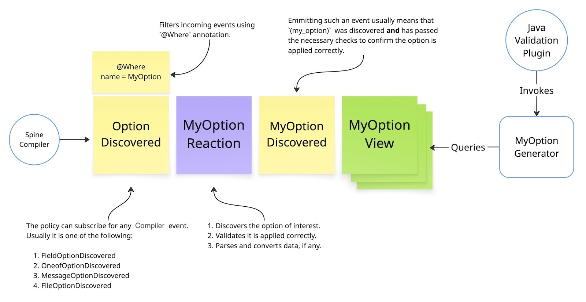

# Custom validation

Users can extend the library by providing custom Protobuf options and code generation logic.

Follow these steps to create a custom option:

1. Declare a Protobuf [extension](https://protobuf.dev/programming-guides/proto3/#customoptions)
   in your `.proto` file.
2. Register it via `io.spine.option.OptionsProvider`.
3. Implement the following entities:
    - Reaction (`MyOptionReaction`) – discovers and validates the option.
    - View (`MyOptionView`) – accumulates valid option applications.
    - Generator (`MyOptionGenerator`) – generates Java code for the option.
4. Register them via `io.spine.tools.validation.java.ValidationOption`.

Below is a workflow diagram for a typical option:

## What’s next

- [Using validators](../04-validators/)
- Learn where this plugs in: [Architecture](../09-developers-guide/architecture.md).

Take a look at the `:tests:extensions` module that contains a full example of
implementation of the custom `(currency)` option.

Note that a custom option can provide several policies and views, but only one generator.
This allows building more complex models, using more entities and events.

Let's take a closer look at each entity.

### Reaction

Usually, this is an entry point to the option handling.

The reaction subscribes to one of `*OptionDiscovered` events:

- `FileOptionDiscovered`.
- `MessageOptionDiscovered`.
- `FieldOptionDiscovered`.
- `OneofOptionDiscovered`.

It filters incoming events, taking only those who contain the option of the interest. The reaction
may validate the option application, query `TypeSystem`, extract and transform data arrived with
the option, if any. Once ready, it emits an event signaling that the discovered option is valid
and ready for the code generation.

The reaction may report a compilation warning or an error, failing the whole compilation if it
finds an illegal application of the option.

For example:

1. An unsupported field type.
2. Illegal option content (invalid regex, parameter, signature).

The reaction may just ignore the discovered option and emit `NoReaction`. A typical example
of this is a boolean option, such as `(required)`, which does nothing when it is set to `false`.

The desired behavior depends on the option itself.

### View

Views accumulate events from policies, serving as data providers for the validation model
used by code generators. Views are typically simple and only accumulate data; for more complex
logic, use policies.

Usually, one view represents a single application of an option.

### Generator

The generator is an entity that provides an actual implementation of the option behavior.
The generator produces Java code for every application of that option within the message type.

It has access to the `Querying` interface and can query views to find those belonging
to the processed message type.
