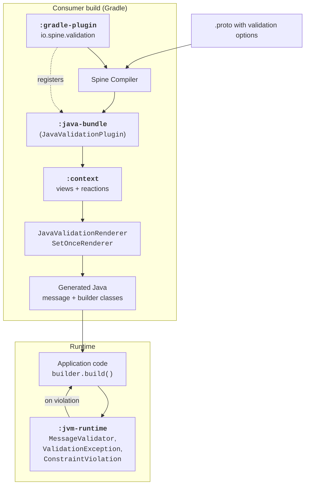

# Architecture

Spine Validation has two main responsibilities, and the codebase is organized around the
boundary between them:

1. **At build time** — translate validation options declared in `.proto` files into Java
   code that enforces those constraints inside the generated message and builder classes.
2. **At runtime** — provide the small library of types that the generated code calls into
   to evaluate constraints and report violations.

This page describes how the modules in this repository implement that split. For an
inventory of every module, see “[Key modules](key-modules.md)”.

## The compile-time / runtime split

The build-time work is performed by a Spine Compiler plugin. The Spine Compiler runs
during the consumer project's build, after `protoc` produces the initial Java sources.
The plugin inspects the Protobuf model, detects validation options on fields and messages,
and injects validation logic into the generated classes.

The runtime library is small on purpose. It exposes the SPI that user code or generated
code calls (`MessageValidator`, `ValidatorRegistry`), the exception type
(`ValidationException`), and the Protobuf types used to describe violations
(`ConstraintViolation`, `ValidationError`, `TemplateString`). Everything else — the
constraint logic itself — lives in the generated code, not in a runtime evaluator.

This split is the main architectural decision in the project. Constraints are *compiled*,
not *interpreted*. There is no rule engine running at message construction time; there is
only the inlined Java code that the compiler plugin produced.

## The build-time pipeline

The compiler plugin is structured as two layers:

- **`:context`** — a language-agnostic model of the validation rules discovered in a set of
  `.proto` files. This module is a Spine Bounded Context: validation options become
  events, events feed projections (views), and reactions wire them together.
- **`:java`** — a `ValidationPlugin` subclass that consumes the model from `:context` and
  emits Java code. Code emission is performed by two renderers:
  `JavaValidationRenderer` for assertion-style options, and `SetOnceRenderer` for
  `(set_once)`, whose semantics modify builder behavior rather than add a check.

The base plugin class lives in
[`ValidationPlugin.kt`](https://github.com/SpineEventEngine/validation/blob/master/context/src/main/kotlin/io/spine/tools/validation/ValidationPlugin.kt)
and registers the built-in views and reactions:

```kotlin
public abstract class ValidationPlugin(
    renderers: List<Renderer<*>> = emptyList(),
    views: Set<Class<out View<*, *, *>>> = setOf(),
    viewRepositories: Set<ViewRepository<*, *, *>> = setOf(),
    reactions: Set<Reaction<*>> = setOf(),
) : Plugin(...)
```

The Java implementation in
[`JavaValidationPlugin.kt`](https://github.com/SpineEventEngine/validation/blob/master/java/src/main/kotlin/io/spine/tools/validation/java/JavaValidationPlugin.kt)
adds the Java renderers and folds in any custom options discovered through the SPI:

```kotlin
public open class JavaValidationPlugin : ValidationPlugin(
    renderers = listOf(
        JavaValidationRenderer(customGenerators = customOptions.map { it.generator }),
        SetOnceRenderer()
    ),
    views = customOptions.flatMap { it.view }.toSet(),
    reactions = customOptions.flatMap { it.reactions }.toSet(),
)
```

`customOptions` is loaded via `ServiceLoader<ValidationOption>`, which is what makes the
plugin extensible without recompiling the Validation library. See
[`ValidationOption.kt`](https://github.com/SpineEventEngine/validation/blob/master/java/src/main/kotlin/io/spine/tools/validation/java/ValidationOption.kt)
for the SPI itself, and the “[Custom validation](../05-custom-validation/)” section of
the User's Guide for the consumer-facing walkthrough.

## The runtime library

Generated validation code depends only on `:jvm-runtime`. The most important entry points
are:

- [`MessageValidator`](https://github.com/SpineEventEngine/validation/blob/master/jvm-runtime/src/main/kotlin/io/spine/validation/MessageValidator.kt)
  — SPI for attaching custom validators to message types, including types declared in
  third-party `.proto` files. See the User's Guide “[Using validators](../04-validators/)”
  section.
- [`ValidatorRegistry`](https://github.com/SpineEventEngine/validation/blob/master/jvm-runtime/src/main/kotlin/io/spine/validation/ValidatorRegistry.kt)
  — discovers and applies `MessageValidator` implementations.
- [`validation_error.proto`](https://github.com/SpineEventEngine/validation/blob/master/jvm-runtime/src/main/proto/spine/validation/validation_error.proto)
  — defines `ValidationError` and `ConstraintViolation`, the structured shape of violation
  reports.
- [`error_message.proto`](https://github.com/SpineEventEngine/validation/blob/master/jvm-runtime/src/main/proto/spine/validation/error_message.proto)
  — defines `TemplateString`, the placeholder format used by error messages.

The runtime library does not parse `.proto` files, does not maintain a rule registry, and
does not interpret constraints. It contains only the types that the generated code and
user code share.

## Distribution and consumer wiring

Two small modules exist purely to make the plugin usable from a consumer project:

- **`:java-bundle`** — repackages `:java` and its non-shared transitive dependencies as a
  single fat JAR. The Spine Compiler loads validation as a single classpath entry, so
  bundling avoids dependency resolution surprises in the compiler classloader.
- **`:gradle-plugin`** — the `io.spine.validation` Gradle plugin. When applied to a
  consumer project it registers `:java-bundle` on the Spine Compiler's user classpath,
  inserts `JavaValidationPlugin` into the compiler's plugin list, and adds `:jvm-runtime`
  to the consumer's `implementation` configuration so generated code compiles and runs.
  See
  [`ValidationGradlePlugin.kt`](https://github.com/SpineEventEngine/validation/blob/master/gradle-plugin/src/main/kotlin/io/spine/tools/validation/gradle/ValidationGradlePlugin.kt).

## The end-to-end picture

The diagram below shows what happens from the moment a developer writes a `.proto` file
with validation options through to the runtime check that fires when a message is built.



At a glance:

- The Gradle plugin is the only thing the consumer applies. It pulls in the bundle and the
  runtime library transparently.
- The Spine Compiler invokes `JavaValidationPlugin`, which uses `:context` to build a
  language-agnostic model of the constraints, then runs Java renderers to inject code into
  the classes that `protoc` generated.
- At runtime, the application calls into generated code, typically through
  `Builder.build()` or a generated `validate()` method.
  The generated code uses types from `:jvm-runtime` to report violations.

## What's next

- [Key modules](key-modules.md) — the full module inventory, including the test modules.
