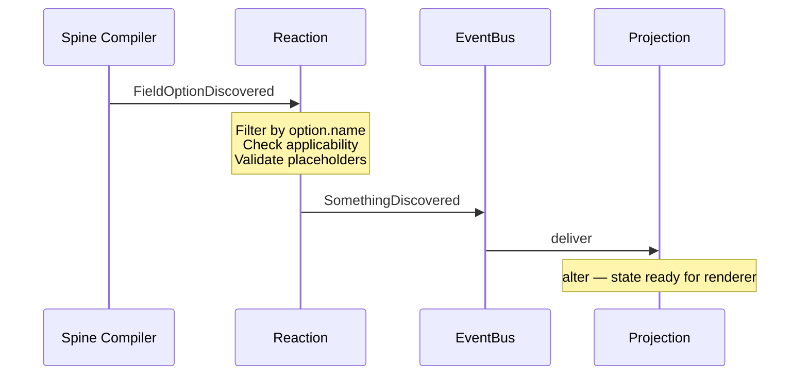

# The validation model

The `:context` module is the language-agnostic half of the Compiler plugin. It does not
emit code. It builds a description of the constraints declared in a set of `.proto` files
and exposes that description as a Bounded Context: an event-sourced model whose state can
be queried by language-specific renderers.

A code-generating renderer in `:java` (see “[Java code generation](java-code-generation.md)”)
consumes that state to produce validation logic. A renderer for another target language
could consume the same state without changes to `:context`.

## The Bounded Context shape

The model is built from four kinds of artefacts that a Spine Bounded Context combines:

- **Domain events** (in `events.proto`) — a closed set of `*Discovered` events, one per
  built-in validation option. Each event carries the data that the rest of the model
  needs to know about a single discovered constraint.
- **Views (projections)** (in `views.proto`) — one projection per option, keyed by the
  field, oneof group, or message that owns the constraint. Each view holds the data the
  renderer will read.
- **Reactions** (Kotlin classes under `option/` and `bound/`) — handlers that subscribe
  to the upstream `FieldOptionDiscovered`, `OneofOptionDiscovered`, and
  `MessageOptionDiscovered` events emitted by the Spine Compiler, validate the option's
  applicability, and emit the matching `*Discovered` domain event.
- **Plugin wiring** — `ValidationPlugin` registers all built-in views and reactions with
  the Compiler, so they are instantiated and connected for every consumer build.

`ValidationPlugin` is the entry point that pulls the four pieces together. It is
language-agnostic and is extended by `JavaValidationPlugin` in `:java` (which only adds
renderers and folds in custom-option contributions, see
“[Architecture](architecture.md)”).

## The lifecycle of an option

The model never reads `.proto` files directly. The Spine Compiler does the parsing and
publishes generic option events. A reaction in `:context` matches each event by option
name, decides whether the option applies, and either emits a domain event or stays
silent. The matching projection then folds the event into its state. By the time the
build leaves `:context`, the model is just a set of populated views.

The flow for a single field-level option looks like this:



`OneofOptionDiscovered` and `MessageOptionDiscovered` follow the same shape, with the
appropriate AST node as the projection's ID.

### Event filtering by option name

Reactions select their input by matching the upstream event's `option.name` field. The
constant [`OPTION_NAME`][option-name] is the field path; the option-name constants in
[`OptionNames.kt`][option-names] are the equality values:

<embed-code
  file="$context/src/main/kotlin/io/spine/tools/validation/option/required/RequiredOption.kt"
  start="internal class RequiredReaction"
  end="^\}">
</embed-code>
```kotlin
internal class RequiredReaction : Reaction<FieldOptionDiscovered>() {

    @React
    override fun whenever(
        @External @Where(field = OPTION_NAME, equals = REQUIRED)
        event: FieldOptionDiscovered,
    ): EitherOf2<RequiredFieldDiscovered, NoReaction> {
        val field = event.subject
        val file = event.file
        checkFieldType(field, file)

        if (!event.option.boolValue) {
            return ignore()
        }

        val defaultMessage = defaultErrorMessage<IfMissingOption>()
        return requiredFieldDiscovered {
            id = field.ref
            subject = field
            defaultErrorMessage = defaultMessage
        }.asA()
    }
}
```

Two details are worth highlighting:

- The reaction's return type uses `EitherOf2<…, NoReaction>`. The `(required) = false`
  case returns `NoReaction`, which is how the model communicates *“the option is applied
  correctly but disabled”*. No domain event is emitted, so no projection is created, and
  the renderer sees the field as if the option were absent.
- The reaction is the only place where applicability is checked. By the time the
  matching `*Discovered` event reaches the bus, the option has been confirmed valid for
  this field. Projections trust this contract and never re-check.

### The discovered event

For every option there is a `<Option>FieldDiscovered`, `<Option>OneofDiscovered`, or
`<Option>MessageDiscovered` event that carries the data extracted from the option's
declaration:

<embed-code
  file="$context/src/main/proto/spine/validation/events.proto"
  start="message RequiredFieldDiscovered"
  end="^\}">
</embed-code>
```protobuf
message RequiredFieldDiscovered {

    compiler.FieldRef id = 1;

    // The field in which the option was discovered.
    compiler.Field subject = 2;

    // The default error message template.
    string default_error_message = 3;
}
```

The shape mirrors the corresponding view: the `id` is the projection key, and the
remaining fields are what the projection records.

### The projection

Each projection is declared in `views.proto` with `option (entity).kind = PROJECTION`,
and is implemented in Kotlin as a `View`:

<embed-code
  file="$context/src/main/proto/spine/validation/views.proto"
  start="message RequiredField \{"
  end="^\}">
</embed-code>
```protobuf
message RequiredField {
    option (entity).kind = PROJECTION;

    compiler.FieldRef id = 1;

    // The field in which the option was discovered.
    compiler.Field subject = 2;

    // The error message template.
    string error_message = 3;
}
```

{}
The `PROJECTION` entity kind has an alias called `VIEW` that works exactly the same
way. The two names are interchangeable in `.proto` declarations; this guide uses
`PROJECTION` consistently to match what is written in `views.proto`.
{}

<embed-code
  file="$context/src/main/kotlin/io/spine/tools/validation/option/required/RequiredOption.kt"
  start="internal class RequiredFieldView"
  end="^\}">
</embed-code>
```kotlin
internal class RequiredFieldView : View<FieldRef, RequiredField, RequiredField.Builder>() {

    @Subscribe
    fun on(e: RequiredFieldDiscovered) {
        val currentMessage = state().errorMessage
        val message = currentMessage.ifEmpty { e.defaultErrorMessage }
        alter {
            subject = e.subject
            errorMessage = message
        }
    }

    @Subscribe
    fun on(e: IfMissingOptionDiscovered) = alter {
        errorMessage = e.customErrorMessage
    }
}
```

Two small but important properties of projections in this model:

- A projection can subscribe to *more than one* event. `RequiredFieldView` folds
  `RequiredFieldDiscovered` and the companion `IfMissingOptionDiscovered`, so the final
  `errorMessage` ends up correct regardless of which event arrives first.
- Defaults are resolved in the projection, not in the reaction. The reaction provides
  the option's `(default_message)` as a fallback; the projection picks it only when no
  custom message has already been recorded.

## Companion options

Several options exist purely to override an aspect of a primary option — `(if_missing)`
overrides the error message of `(required)`, `(if_invalid)` overrides `(validate)`, and
`(if_set_again)` overrides `(set_once)`. Each companion has its own reaction, its own
discovery event, and its data lands in the *primary*'s projection, not a separate one.

Companion reactions enforce that the companion is never used standalone:

<embed-code
  file="$context/src/main/kotlin/io/spine/tools/validation/option/CompanionOptions.kt"
  start="internal fun GeneratedExtension"
  end="^\}">
</embed-code>
```kotlin
internal fun GeneratedExtension<*, *>.checkPrimaryApplied(
    primary: GeneratedExtension<*, *>,
    field: Field,
    file: File
) {
    val primaryOption = field.findOption(primary)
    val primaryName = primaryOption?.name
    val companionName = this.descriptor.name
    Compilation.check(primaryOption != null, file, field.span) {
        "The `${field.qualifiedName}` field has the `($companionName)` companion option" +
                " applied without its primary `($primaryName)` option. Companion options" +
                " must always be used together with their primary counterparts."
    }
}
```

This is the model's only way to encode the dependency between two separate Protobuf
options: the companion fails compilation if the primary is absent, and otherwise
contributes its data to the primary's projection.

## Built-in options at a glance

The table below maps each built-in option to its primary model elements. Every row uses
the same wiring described above; the differences are in which AST node owns the
constraint and which payload the event carries.

| **Option**            | **Subject / Reaction / Event / Projection** |
|-----------------------|---------------------------------------------|
| `(required)`          | field<br>`RequiredReaction`<br>`RequiredFieldDiscovered`<br>`RequiredField` |
| `(if_missing)`        | field<br>`IfMissingReaction`<br>`IfMissingOptionDiscovered`<br>`RequiredField` |
| `(pattern)`           | field<br>`PatternReaction`<br>`PatternFieldDiscovered`<br>`PatternField` |
| `(goes)`              | field<br>`GoesReaction`<br>`GoesFieldDiscovered`<br>`GoesField` |
| `(distinct)`          | field<br>`DistinctReaction`<br>`DistinctFieldDiscovered`<br>`DistinctField` |
| `(if_has_duplicates)` | field<br>`IfHasDuplicatesReaction`<br>`IfHasDuplicatesOptionDiscovered`<br>`DistinctField` |
| `(validate)`          | field<br>`ValidateReaction`<br>`ValidateFieldDiscovered`<br>`ValidateField` |
| `(if_invalid)`        | field<br>`IfInvalidReaction`<br>(folded into `ValidateField`)<br>`ValidateField` |
| `(set_once)`          | field<br>`SetOnceReaction`<br>`SetOnceFieldDiscovered`<br>`SetOnceField` |
| `(if_set_again)`      | field<br>`IfSetAgainReaction`<br>`IfSetAgainOptionDiscovered`<br>`SetOnceField` |
| `(min)` / `(max)`     | numeric field<br>`MinReaction` / `MaxReaction`<br>(in `bound/events.proto`)<br>`MinField` / `MaxField` |
| `(range)`             | numeric field<br>`RangeReaction`<br>`RangeFieldDiscovered`<br>`RangeField` |
| `(choice)`            | oneof group<br>`ChoiceReaction`<br>`ChoiceOneofDiscovered`<br>`ChoiceOneof` |
| `(require)`           | message<br>`RequireReaction`<br>`RequireMessageDiscovered`<br>`RequireMessage` |

The numeric bound options live under [`bound/`][bound-pkg] because they share parsing
infrastructure (`NumericBoundParser`, `KNumericBound`, the field-vs-number bound
representation) that the other options do not need. Their wiring follows the same
pattern.

## Error reporting conventions

`:context` reports two kinds of problems:

1. **Compilation errors** — the option is misapplied (wrong field type, malformed range
   syntax, unsupported placeholder, etc.). The model refuses to emit a discovery event;
   the build fails with a message that points at the offending declaration.
2. **Compilation warnings** — the option is recognised but discouraged. The
   `(is_required)` warning emitted by `IsRequiredReaction` is the canonical example.

Both are produced through `io.spine.tools.compiler.Compilation`, which takes the
offending file and span and a lazy message lambda. The lambda is only evaluated on
failure, so it is cheap to inline detailed diagnostics:

```kotlin
Compilation.check(field.type.isSupported(), file, field.span) {
    "The field type `${field.type.name}` of the `${field.qualifiedName}` is not supported" +
            " by the `($REQUIRED)` option. Supported field types: messages, enums," +
            " strings, bytes, repeated, and maps."
}
```

The same `Compilation.check` / `Compilation.error` / `Compilation.warning` API is used
across every reaction, which keeps diagnostics consistent.

### Error message templates and placeholders

Custom error messages declared via the option (for example `(pattern).error_msg`) are
not free-form. Each option declares the placeholders it supports, and the reaction
validates the template before the event is emitted:

<embed-code
  file="$context/src/main/kotlin/io/spine/tools/validation/ErrorPlaceholders.kt"
  start="private fun String.checkPlaceholders"
  end="^\}">
</embed-code>
```kotlin
private fun String.checkPlaceholders(
    supported: Set<ErrorPlaceholder>,
    declaration: String,
    span: Span,
    file: File,
    option: String
) {
    val template = this
    val missing = missingPlaceholders(template, supported)
    Compilation.check(missing.isEmpty(), file, span) {
        "The $declaration specifies an error message for the `($option)` option using unsupported" +
                " placeholders: `$missing`. Supported placeholders are the following:" +
                " `${supported.map { it.value }}`."
    }
}
```

Catching unknown placeholders here, in the model, is what allows the renderer to assume
that every placeholder it sees in the projection state has a known meaning. The full
list of placeholders is enumerated in
[`ErrorPlaceholder.kt`][error-placeholder]. The runtime library has a deliberately
duplicated `RuntimeErrorPlaceholder` enum; the duplication is documented in the
KDoc on `ErrorPlaceholder` and is expected to disappear once the Compiler and the
runtime share a common base.

When no custom message is provided, the reaction falls back to the option's
`(default_message)` annotation read by [`defaultErrorMessage`][default-message]. That
default is recorded on the discovery event and the projection picks it up only if no
custom message has been supplied — see `RequiredFieldView` above.

## How custom options plug in

The `ValidationOption` SPI is declared in `:java` (see
[`ValidationOption.kt`][validation-option-spi]), but two of its three members —
`reactions` and `view` — are *model-side* contributions: a custom option supplies its
own reactions and views, written against the same `:context` building blocks described
on this page.

`JavaValidationPlugin` discovers SPI implementations through `ServiceLoader` and folds
them into the same plugin registration that brings in the built-ins:

```kotlin
public open class JavaValidationPlugin : ValidationPlugin(
    renderers = listOf(
        JavaValidationRenderer(customGenerators = customOptions.map { it.generator }),
        SetOnceRenderer()
    ),
    views = customOptions.flatMap { it.view }.toSet(),
    reactions = customOptions.flatMap { it.reactions }.toSet(),
)
```

From the model's point of view, custom reactions and views are indistinguishable from
the built-ins. They subscribe to the same upstream `FieldOptionDiscovered` /
`OneofOptionDiscovered` / `MessageOptionDiscovered` events, filter by `OPTION_NAME`,
emit their own `*Discovered` events, and project them into their own views. The third
SPI member, `generator`, is the *Java-side* contribution; it is covered in
“[Java code generation](java-code-generation.md)”.

The end-to-end walkthrough — declaring a new option, adding the reaction and view,
hooking the generator, and writing tests — lives in
“[Adding a new built-in validation option](adding-a-built-in-option.md)”. The
consumer-facing version of the same SPI is covered by
“[Custom validation](../05-custom-validation/)” in the User's Guide.

## What's next

- [Java code generation](java-code-generation.md) — how the populated projections become
  validation code in `:java`.
- [Runtime library](runtime-library.md) — what the generated code calls into at execution
  time in `:jvm-runtime`.
- [Adding a new built-in validation option](adding-a-built-in-option.md) — the
  contributor walkthrough that ties this page to the rest of the guide.

[option-name]: https://github.com/SpineEventEngine/validation/blob/master/context/src/main/kotlin/io/spine/tools/validation/OptionName.kt
[option-names]: https://github.com/SpineEventEngine/validation/blob/master/context/src/main/kotlin/io/spine/tools/validation/option/OptionNames.kt
[bound-pkg]: https://github.com/SpineEventEngine/validation/tree/master/context/src/main/kotlin/io/spine/tools/validation/bound
[error-placeholder]: https://github.com/SpineEventEngine/validation/blob/master/context/src/main/kotlin/io/spine/tools/validation/ErrorPlaceholder.kt
[default-message]: https://github.com/SpineEventEngine/validation/blob/master/context/src/main/kotlin/io/spine/tools/validation/DefaultErrorMessage.kt
[validation-option-spi]: https://github.com/SpineEventEngine/validation/blob/master/java/src/main/kotlin/io/spine/tools/validation/java/ValidationOption.kt
