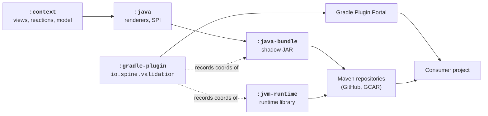

# Build, packaging, and release

This page describes how the Gradle multi-project build is wired, what each
publishable module produces, and how the resulting artifacts reach downstream
consumers. It is the contributor-side counterpart to “[Adding Validation to your
build](../user/01-getting-started/adding-to-build/)” in the User's Guide:
where that page shows how a *consumer* applies the plugin, this page shows how
the plugin and its dependencies are *produced*.

For day-to-day commands (`./gradlew build`, `./gradlew dokka`, …) see
[`running-builds.md`][running-builds] in the `.agents/` directory; this page
focuses on the structure rather than the commands.

## The multi-project layout

The repository is a single Gradle build. Subprojects are declared in
[`settings.gradle.kts`][settings] and split into three groups:

| Group          | Modules                               | Role                                                                             |
|----------------|---------------------------------------|----------------------------------------------------------------------------------|
| Core library   | `:context`, `:java`, `:jvm-runtime`   | The validation model, the Java code generator, and the runtime library.          |
| Distribution   | `:java-bundle`, `:gradle-plugin`      | Packaging layer that turns the core library into something a consumer can apply. |
| Tests and docs | `:context-tests`, `:tests:*`, `:docs` | Compilation tests, integration suites, and the documentation site.               |

Every published JVM subproject applies the [`module`][module-convention]
convention plugin from `buildSrc/`, which sets up Java + Kotlin compilation,
the Detekt and PMD analyzers, the Dokka and Javadoc tasks, the Spine BOMs, and
`maven-publish`. The [`fat-jar`][fat-jar-convention] convention layers shadow
JAR packaging on top of `module` for `:java-bundle` (see below). The `:tests:*`
modules do not publish, so they apply `id("module-testing")` instead — a
lighter convention that wires up JUnit, Kotest, and Truth as test dependencies
and registers the test tasks without bringing in the publishing machinery.

The single source of truth for the project version is
[`version.gradle.kts`][version-gradle], which exposes `validationVersion`
through Gradle's `extra` properties. The root build script applies this file to
every subproject:

```kotlin
allprojects {
    apply(from = "$rootDir/version.gradle.kts")
    group = "io.spine.tools"
    version = extra["validationVersion"]!!
}
```

A single bump in `version.gradle.kts` therefore moves every artifact this
repository publishes — there is no per-module version state to keep in sync.

## Publishable modules

The core library and the distribution layer publish; the test modules and
`:docs` do not. The publishing setup lives in [`build.gradle.kts`][root-build]:

```kotlin
spinePublishing {
    artifactPrefix = "spine-validation-"
    toolArtifactPrefix = "validation-"
    modules = setOf(
        "context",
        "java",
        "java-bundle",
        "jvm-runtime",
    )
    modulesWithCustomPublishing = setOf(
        "java-bundle",
        "gradle-plugin",
    )
    destinations = with(PublishingRepos) {
        setOf(
            gitHub("validation"),
            cloudArtifactRegistry
        )
    }
}
```

Two artifact prefixes coexist because `:java-bundle` and `:gradle-plugin` belong
to the `io.spine.tools` group and use the `validation-` prefix, while the rest
of the modules publish under the `io.spine` group with the `spine-validation-`
prefix. The `MavenArtifact` declarations in
[`ValidationSdk.kt`][validation-sdk] inside `:gradle-plugin` reflect both
conventions:

```kotlin
val jvmRuntime: MavenArtifact = Meta.dependency(
    Module("io.spine", "spine-validation-jvm-runtime")
)

val javaCodegenBundle: MavenArtifact = Meta.dependency(
    Module("io.spine.tools", "validation-java-bundle")
)
```

`modulesWithCustomPublishing` lists the two modules whose publication is set up
inside the module itself rather than by the root convention. Their stories are
worth a closer look.

## Why `:java-bundle` exists

The Spine Compiler loads each compiler plugin from a single classpath entry on
its *user classpath*. If `:java` was published as a normal Maven artifact, every
consumer would have to resolve its full transitive dependency graph onto the
compiler classloader, where Gradle's resolution rules no longer apply and
version mismatches are not easy to diagnose. `:java-bundle` solves this by
shipping `:java` and its non-shared dependencies as one shadow JAR.

The `:java-bundle` build script applies the [`fat-jar`][fat-jar-convention]
convention, which is built on
[`com.gradleup.shadow`][shadow]:

```kotlin
plugins {
    `fat-jar`
}
```

The `fat-jar` convention plugin configures `tasks.shadowJar` to exclude
everything that the Spine Compiler's own classloader already provides — Gradle
internals, Kotlin stdlib, IntelliJ Platform annotations, third-party plugin
declarations — and then publishes the resulting JAR as a `MavenPublication` named `fatJar`:

```kotlin
publishing {
    publications {
        create("fatJar", MavenPublication::class) {
            artifact(tasks.shadowJar)
        }
    }
}
```

The `:java-bundle` build script
([`java-bundle/build.gradle.kts`][java-bundle-build]) further excludes groups of
dependencies that the Compiler backend already exposes — Protobuf, Guava, ASM,
Roaster, Compiler modules, JavaPoet, and the Spine `Base`, `Logging`, `Time`,
`Reflect`, and `CoreJvm` libraries. These exclusions are not optional: pulling
two copies of these libraries into the compiler classloader produces hard-to-
diagnose `LinkageError`s during code generation.

The bundle uses the same `validationVersion` as everything else, with one
practical consequence — bumping the version produces a new bundle that downstream
projects pick up the next time they refresh their Compiler user classpath.

## Why `:gradle-plugin` is separate from `:java-bundle`

The Gradle plugin and the bundle play different roles, and conflating them would
force every consumer to put compiler-internal classes on Gradle's *build*
classpath:

- **`:gradle-plugin`** runs *during Gradle configuration*. It is loaded into
  Gradle's classloader when the consumer applies `id("io.spine.validation")`.
  Its job is to register the bundle on the Spine Compiler's user classpath, add
  the runtime as an `implementation` dependency, and apply the Protobuf and
  Spine Compiler Gradle plugins so the consumer does not have to. The relevant
  source is [`ValidationGradlePlugin.kt`][validation-gradle-plugin].
- **`:java-bundle`** runs *inside the Spine Compiler*, not inside Gradle. It is
  invoked through the user classpath the plugin set up.

Because the two layers run in different classloaders, they need different
dependency closures. `:gradle-plugin` depends only on Gradle and Spine Compiler
APIs needed for configuration; `:java-bundle` carries the renderers,
the model, and the Spine Compiler libraries needed to *execute* code generation.

`:gradle-plugin` declares its own publication through `gradlePlugin { … }` and
uses the `io.spine.artifact-meta` plugin to record the resolved coordinates of
the bundle and the runtime as metadata on the published plugin JAR. The
[`Meta`][gradle-plugin-meta] object inside the plugin reads that metadata at
apply time and turns it into the `MavenArtifact` instances seen above. As a
result, the version of the bundle and runtime that a consumer pulls in is
fixed by the version of `:gradle-plugin` they apply — there is no separate
coordination step.

## The build pipeline at a glance



In words:

- `:context` and `:java` compile as ordinary Kotlin libraries.
- `:java-bundle` shadows `:java` into a single JAR.
- `:jvm-runtime` compiles separately; it is the only artifact a consumer's
  *application* code links against.
- `:gradle-plugin` records the coordinates of the bundle and the runtime so
  applying the plugin is enough to configure both halves of the consumer build.

## Publication destinations

The publication targets are configured in the `spinePublishing { destinations }`
block above. The library artifacts go to:

- The repository's [GitHub Packages registry][github-packages-validation]
  (`gitHub("validation")` resolves to `maven.pkg.github.com/SpineEventEngine/validation`).
- Spine's Google Cloud Artifact Registry (`cloudArtifactRegistry`).

The Gradle plugin has an additional destination — the [Gradle Plugin
Portal][gradle-plugin-portal] — configured by the `java-gradle-plugin` and
`com.gradle.plugin-publish` plugins applied via the publishing convention.
That is the destination consumers reach when they write
`id("io.spine.validation")` in their `plugins { … }` block.

Publication is automated by the
[`publish.yml`][publish-workflow] GitHub Actions workflow, which runs on every
push to `master` after PR checks have already verified the build:

```yaml
- name: Publish artifacts to Maven
  run: ./gradlew publish -x test --stacktrace
```

`-x test` is intentional — the same commit has just been validated by the
per-PR build, and re-running the test suite during publication doubles the
release time without adding signal. This makes `master` the single mainline:
every merge produces a new `2.0.0-SNAPSHOT.<n>` build with a higher patch
counter, and downstream consumers refresh against it.

## Downstream consumers

Two kinds of downstream consumer pick up Validation artifacts:

- **Application projects** apply `id("io.spine.validation")` in their
  `plugins { … }` block. They never reference `:java-bundle` or `:jvm-runtime`
  directly — the Gradle plugin adds both, and `version.gradle.kts` in *this*
  repository determines which versions they get. The consumer-side flow is
  documented in “[Adding Validation to your build](../user/01-getting-started/adding-to-build/)”.

- **Tooling projects** that bundle the Validation Compiler into their own
  Spine Compiler distribution. The most prominent example is the
  [CoreJvm Compiler][core-jvm-compiler]: it depends on `:java-bundle` and
  `:jvm-runtime` directly so the validation pipeline runs as part of the
  CoreJvm code-generation flow without the consumer needing to apply
  `io.spine.validation` separately. The `Validation.javaBundle(version)` and
  `Validation.runtime(version)` references in
  [`gradle-plugin/build.gradle.kts`][gradle-plugin-build] declare the
  coordinates that downstream tooling can resolve symmetrically.

The bundle's coordinates and the runtime's coordinates are deliberately stable
across this repository's lifetime: renaming either would force a coordinated
release across every downstream tool that resolves it by name.

## What's next

- “[Key modules](key-modules.md)” — one-line descriptions of every module shown
  on this page, plus the test modules.
- “[Architecture](architecture.md)” — the compile-time/runtime split that
  motivates the `:java`/`:java-bundle`/`:jvm-runtime` separation.
- “[Testing strategy](testing-strategy.md)” — what each `:tests:*` module
  exists to verify, and how they are wired into the build.

[settings]: https://github.com/SpineEventEngine/validation/blob/master/settings.gradle.kts
[root-build]: https://github.com/SpineEventEngine/validation/blob/master/build.gradle.kts
[version-gradle]: https://github.com/SpineEventEngine/validation/blob/master/version.gradle.kts
[module-convention]: https://github.com/SpineEventEngine/validation/blob/master/buildSrc/src/main/kotlin/module.gradle.kts
[fat-jar-convention]: https://github.com/SpineEventEngine/validation/blob/master/buildSrc/src/main/kotlin/fat-jar.gradle.kts
[java-bundle-build]: https://github.com/SpineEventEngine/validation/blob/master/java-bundle/build.gradle.kts
[gradle-plugin-build]: https://github.com/SpineEventEngine/validation/blob/master/gradle-plugin/build.gradle.kts
[validation-sdk]: https://github.com/SpineEventEngine/validation/blob/master/gradle-plugin/src/main/kotlin/io/spine/tools/validation/gradle/ValidationSdk.kt
[validation-gradle-plugin]: https://github.com/SpineEventEngine/validation/blob/master/gradle-plugin/src/main/kotlin/io/spine/tools/validation/gradle/ValidationGradlePlugin.kt
[gradle-plugin-meta]: https://github.com/SpineEventEngine/validation/blob/master/gradle-plugin/src/main/kotlin/io/spine/tools/validation/gradle/Meta.kt
[publish-workflow]: https://github.com/SpineEventEngine/validation/blob/master/.github/workflows/publish.yml
[shadow]: https://gradleup.com/shadow/
[github-packages-validation]: https://github.com/SpineEventEngine/validation/packages
[gradle-plugin-portal]: https://plugins.gradle.org/plugin/io.spine.validation
[core-jvm-compiler]: https://github.com/SpineEventEngine/core-jvm-compiler
[running-builds]: https://github.com/SpineEventEngine/validation/blob/master/.agents/running-builds.md
